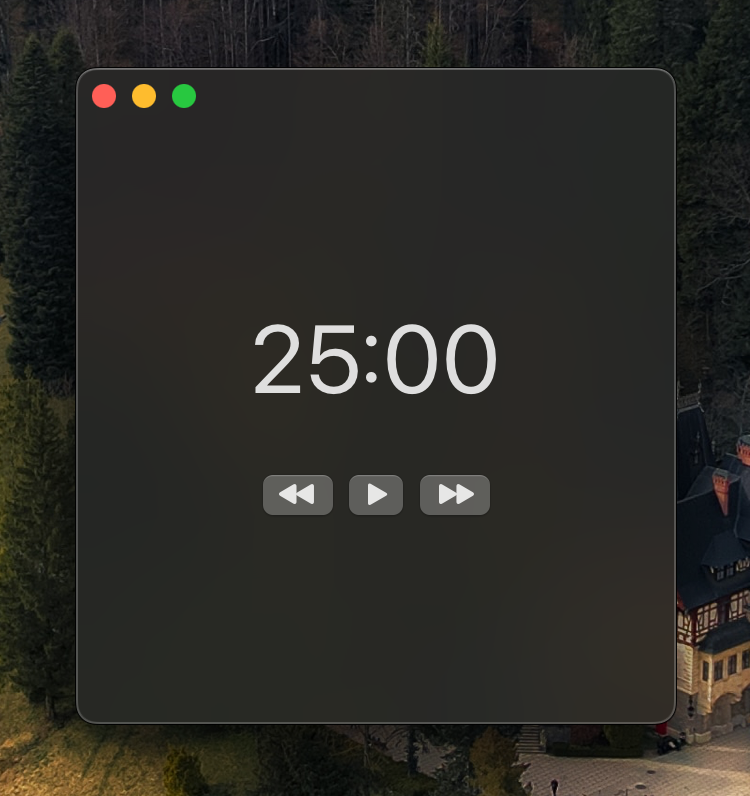

# powo

Powo is a SwiftUI Pomodoro Timer Application.

This is my first SwiftUI project and it aims to be an alternative to _Solanum_, a popular pomodoro available for Linux systems.

### screenshots

